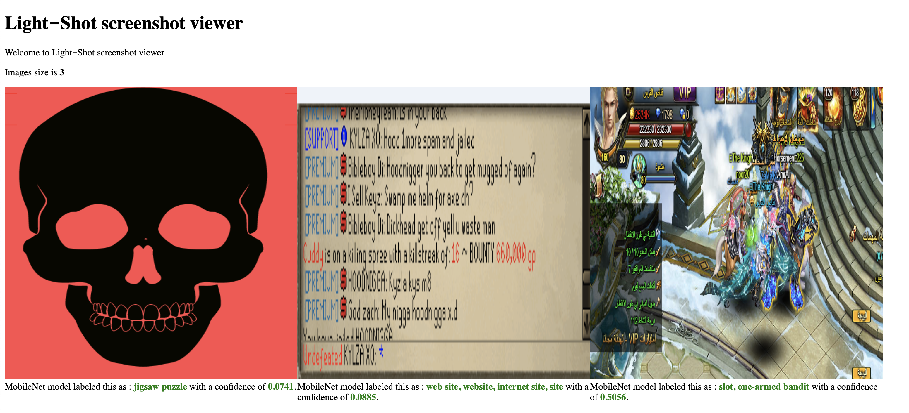

# Light‑Shot screenshot viewer



**Light‑Shot screenshot viewer** 🏞 that allowed users to find random screenshots from **[prnt.sc](https://prnt.sc/)** website with predction of images content. 

## 🤖 Artificial Intelligence

The project support [ml5.js](https://github.com/ml5js/ml5-library/) to predict the images content

# ⏳  Installation

#### 🖐  Requirements

**Supported operating systems**:

-   Ubuntu LTS/Debian 9.x
-   CentOS/RHEL 8
-   macOS Mojave
-   Windows 10

**Node:**

-   NodeJS >= 12 <= 16
-   NPM >= 6.x

Using npm
```bash
git clone https://github.com/MutlaqAldhbuiub/randomPrnt.sc.git
cd randomPrnt
npm install
npm run dev
```

